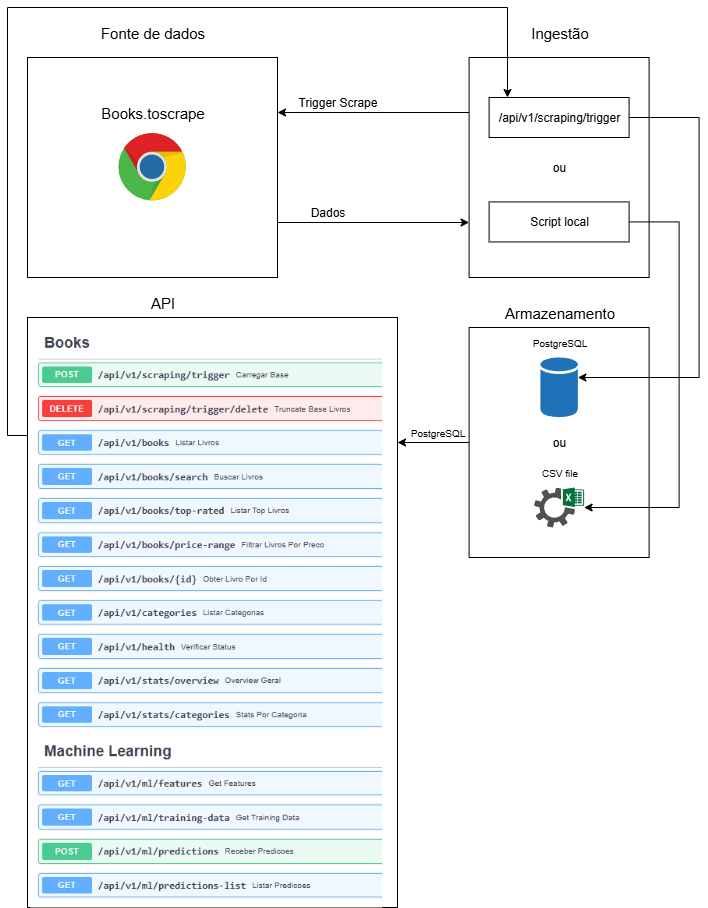

# 📚 Tech Challenge API - Consulta de Livros

API pública desenvolvida como parte do Tech Challenge 2025 (RM366244) para ingestão, consulta e análise de informações de livros, além de integração com modelos de Machine Learning.

---

## 🌐 URL Documentação

```
https://tech-challenge-fase-1-gabrielrm366244.onrender.com/docs
```

## 🌐 URL Dashboard

```
https://tech-challenge-fase-1-gabrielrm366244-wihb.onrender.com/
```
---

## Arquitetura do projeto

<div align="center">
    
</div>

## 1. Fonte de Dados
Books to Scrape é o site de onde os dados são extraídos.

## 2. Ingestão
A coleta de dados pode ser feita de duas maneiras:

Via API usando a rota /api/v1/scraping/trigger para iniciar o scraping remotamente.

Via script local, executado diretamente o arquivo web_scraping.py na pasta de scripts.

Após a coleta, os dados são enviados para a etapa de armazenamento.

## 3. Armazenamento
Os dados coletados podem ser salvos de duas formas:

PostgreSQL (Armazenado depois que a rota /api/v1/scraping/trigger é disparada)

Arquivo CSV (Armazenado depois que o script web_scraping.py é executado)

## 4. API 📖 Endpoints da API

### 📦 Books

#### 🔄 Carregar Base de Dados
**POST** `/api/v1/scraping/trigger`  
> Dispara o scraping e popula a base de dados.

#### 🗑️ Truncar Base de Dados
**DELETE** `/api/v1/scraping/trigger/delete`  
> Remove todos os registros da base.

#### 📚 Listar Todos os Livros
**GET** `/api/v1/books`  
> Lista os livros com opção de `limit`.

#### 🔍 Buscar Livros
**GET** `/api/v1/books/search`  
> Busca por `title` ou `category`.

#### ⭐ Listar Top Livros
**GET** `/api/v1/books/top-rated`  
> Lista livros com maior avaliação.

#### 💰 Filtrar Livros Por Preço
**GET** `/api/v1/books/price-range`  
> Filtros por `min` e `max` de preço.

#### 🔎 Obter Livro por ID
**GET** `/api/v1/books/{id}`  
> Detalhes de um livro específico.

#### 🏷️ Listar Categorias
**GET** `/api/v1/categories`  
> Lista todas as categorias disponíveis.

#### ✅ Verificar Status
**GET** `/api/v1/health`  
> Verifica se a API está funcionando.

#### 📈 Overview Geral
**GET** `/api/v1/stats/overview`  
> Estatísticas gerais sobre os livros.

#### 🗂️ Stats por Categoria
**GET** `/api/v1/stats/categories`  
> Estatísticas agrupadas por categoria.

---

### 🤖 Machine Learning

#### 🔢 Features para Modelos
**GET** `/api/v1/ml/features`  
> Dados preparados para uso como features.

#### 📂 Dados para Treinamento
**GET** `/api/v1/ml/training-data`  
> Dataset formatado para treino de modelo.

#### 📤 Enviar Predições
**POST** `/api/v1/ml/predictions`  
> Recebe dados das predições feitas pelo modelo.

#### 🗃️ Listar Predições
**GET** `/api/v1/ml/predictions-list`  
> Lista todas as predições feitas.

---

### 📈 Métricas de Uso

#### ➕ Criar Métrica
**POST** `/metrics/`  
> Armazena métrica de uso da API.

#### 📋 Listar Métricas
**GET** `/metrics-list`  
> Retorna a lista de métricas registradas.

---

## 🧾 Especificação Técnica

- **Versão da API:** 1.0.0
- **Documentação OpenAPI:** (https://tech-challenge-fase-1-gabrielrm366244.onrender.com/docs)
- **Formato de resposta:** `application/json`

---

## 🛠️ Tecnologias Utilizadas

- **Backend:** Python · FastAPI
- **Scraping:** BeautifulSoup
- **Banco de Dados:** PostgreSQL
- **Hospedagem:** Render
- **Documentação:** OpenAPI 3.1

---

## 👨‍💻 Desenvolvedor

**Gabriel Espanhol**  
RM: RM366244  

---

## 📌 Observações

- Dados extraídos de [Books to Scrape](http://books.toscrape.com)
- API pública e educacional.
- Suporta análise estatística, integração com ML e visualização de métricas.

---